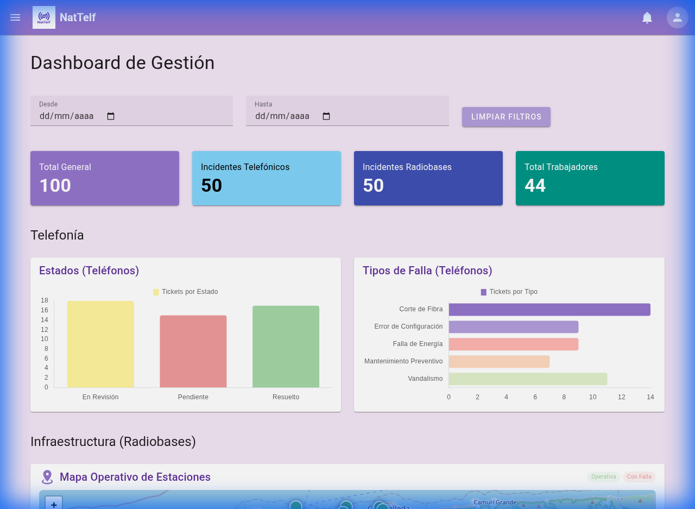
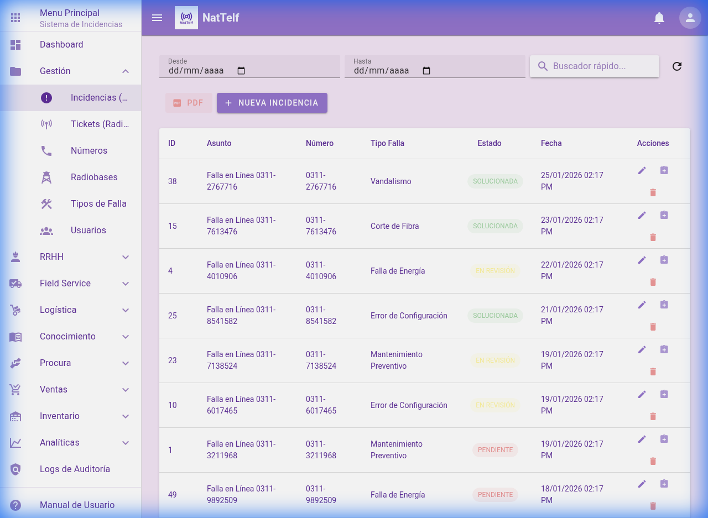
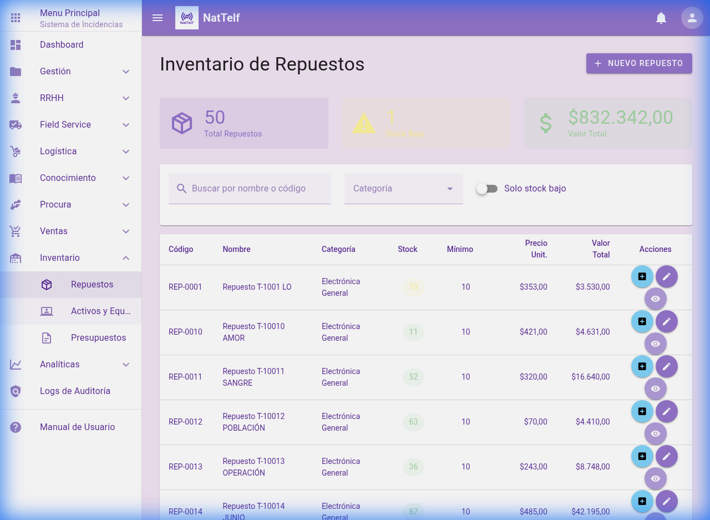

# 📡 NatTelf - Sistema de Gestión de Indicadores

> [!NOTE]
> **NatTelf es una empresa ficticia** creada con fines de demostración de Diseño, Técnica y Desarrollo de Software.

**NatTelf** es una plataforma robusta de **Gestión Empresarial (ERP/CRM)** diseñada específicamente para empresas del sector de **Telecomunicaciones**.

### 🎯 ¿Para qué funciona este sistema?

Este sistema actúa como el núcleo operativo de la empresa, permitiendo:

1.  **Monitoreo Técnico en Tiempo Real**: Centraliza el reporte y seguimiento de averías en líneas telefónicas y radiobases, optimizando los tiempos de respuesta del equipo técnico.
2.  **Gestión de Infraestructura**: Mapeo dinámico y control de estado de estaciones (Radiobases) para asegurar la continuidad del servicio de red.
3.  **Control de Activos e Inventario**: Supervisa el stock de repuestos críticos y la asignación de equipos de trabajo (laptops, teléfonos, herramientas) a los empleados.
4.  **Administración de Operaciones Logísticas**: Registro de mantenimiento preventivo y correctivo de la flota de vehículos, control de combustible y gastos operativos.
5.  **Ciclo Completo de Ventas**: Desde la gestión del stock de SIM Cards (físicas y eSIM) hasta el registro de ventas finales a clientes.
6.  **Gestión de Capital Humano (RRHH)**: Control de expedientes de empleados, jerarquías departamentales y procesamiento de nómina histórica.
7.  **Organización Documental y de Conocimiento**: Repositorio central de contratos y documentos legales con control de versiones, además de una Wiki interna para capacitación técnica.

En resumen, **NatTelf** transforma datos operativos en información visual y accionable, eliminando el desorden administrativo y permitiendo a la gerencia tomar decisiones basadas en métricas reales de productividad y fallas.

---

## 📸 Galería de Interfaces (UI Design)

A continuación, se presenta una muestra del diseño y las capacidades del sistema:

### 📊 Dashboard de Gestión

Visualización en tiempo real de métricas críticas, estados de tickets y distribución de fallas.


### 🎫 Gestión de Incidencias (Tel)

Control detallado de averías telefónicas, asignación de técnicos y seguimiento de ciclos de solución.


### 📦 Inventario de Repuestos

Gestión de stock, control de costos y alertas de inventario bajo para mantenimiento preventivo.


### 👥 Gestión de Personal (RRHH)

Estructura organizativa, gestión de expedientes y control de nómina del equipo técnico.


---

## 🛠️ Arquitectura y Tecnologías

El sistema está construido bajo una robusta arquitectura desacoplada:

- **Backend**: Python 3.11 + **Django 6.0** + Django REST Framework.
  - Base de Datos: MySQL/MariaDB.
  - Seguridad: Autenticación por Tokens e Historial de Auditoría Simple.
- **Frontend**: **Vue.js 3** + **Vite 6** + **Vuetify 3**.
  - Diseño: Material Design con estética personalizada "Purple Premium".
  - Gestión de Estado: Pinia.
- **Reportes**: Generación dinámica de PDF (jspdf) y exportación a Excel.

## ✨ Funcionalidades Clave

1. **Dashboard Multidimensional**: Filtros temporales y gráficos interactivos (ApexCharts/Chart.js).
2. **Gestión de Infraestructura**: Registro y monitoreo de Radiobases con geolocalización.
3. **Control Logístico**: Seguimiento de vehículos, combustible y mantenimiento de flota.
4. **Módulo de Ventas**: Control de SIM Cards (Físicas/eSIM) y gestión de clientes.
5. **Repositorio Documental**: Almacenamiento organizado con control de versiones.
6. **Base de Conocimientos (Wiki)**: Artículos técnicos para soporte de primer nivel.

---

## 🚀 Guía de Instalación Rápida

### Requisitos

- Python 3.11+
- Node.js 18+
- MariaDB / MySQL

### Backend

```bash
cd Backend_Indicadores
python -m venv venv
source venv/bin/activate
pip install -r requirements.txt
python manage.py migrate
python manage.py runserver
```

### Frontend

```bash
cd frontend_indicadores
npm install
npm run dev
```

---

© 2026 NatTelf - Desarrollado por Nathaliee Vargas.
